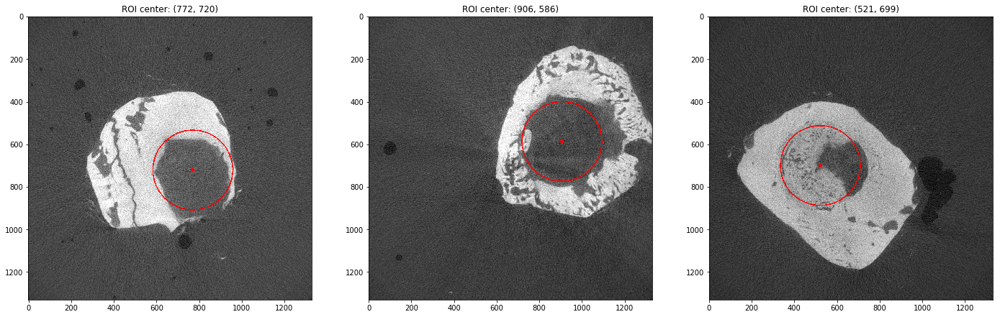
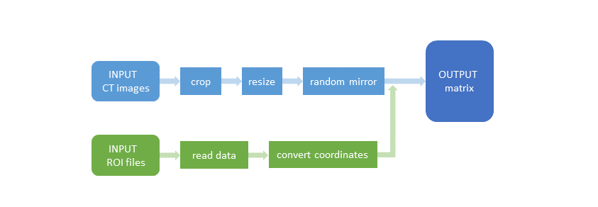
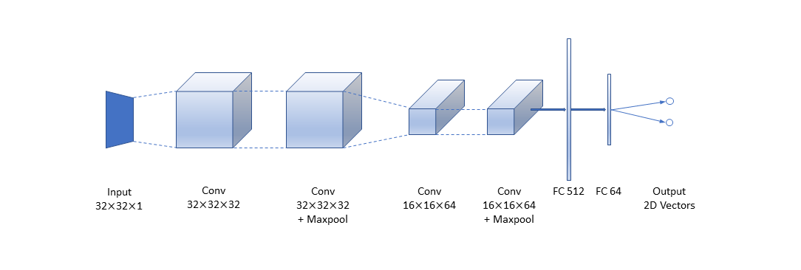
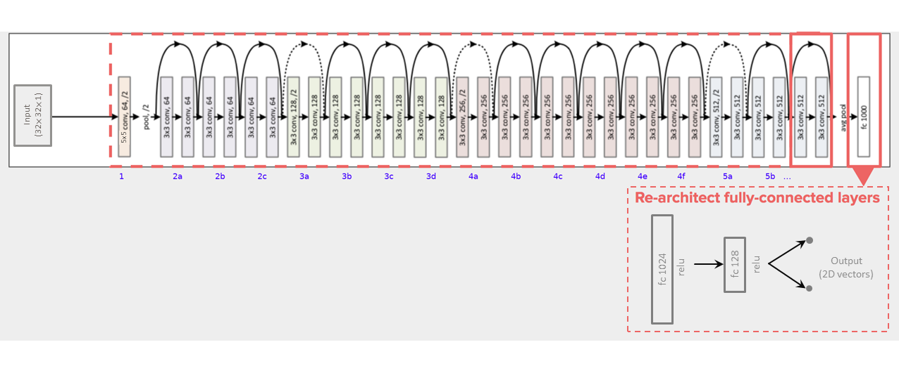
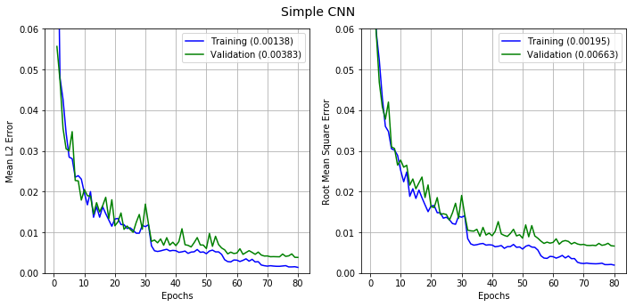
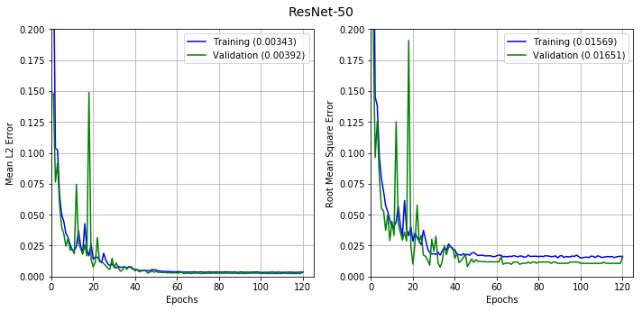

## Detect Defect Area in Cranial CT Scan Images Using CNN and ResNet
#### Authors: Zhichao Pan (charles.zhpan@gmail.com) and Dr. Sophie Yang (yuanyang@utoronto.ca)
@[Bone Interface Group](http://www.ecf.utoronto.ca/~bonehead/), IBBME, University of Toronto 

### Project Overview
The purpose of this project is to create a data science pipeline to automate processing and analyzing of CT scan data obtained from laboratory samples. Specifically, we are interested to apply deep learning techniques to detecting a surgically created circular defect  in every cross-sectional image of mouse cranial bone. 

Regions of defect in the sample images below are circled in red, measured by human experts.



### Data Sets
The mouse cranial CT scan data consists of 5,606 slice images from 65 CT scanned samples. The full dataset for model training can be downloaded from https://www.kaggle.com/chzpan/bone-lab. The directory tree looks like:

```
 .
 |____roi
 |    |____C0005530.ISQroi
 |    |    |____0022-1059-0859.roi
 |    |    |____0023-1059-0859.roi
 |    |    |____...
 |    |____C0005531.ISQroi
 |    |    |____0003-1135-1011.roi
 |    |    |____0004-1135-1011.roi
 |    |    |____...
 |    |____...
 |____trainset
      |____C00055300022.png
      |____C00055300023.png
      |____...
```
 
File Contents
* roi.zip - contains the ground truth of each slice's defect region, measured by human experts. There are 65 sub-directories named with a unique 8-digit sample ID in the form of ``C000XXXX``, so each of them contains all ROI files for an individual sample. The ROI files are named in the form of ``XXXX-XXXX-XXXX``. The first 4 digits is a unique ID assigned to every single slice. The following 8 digits give the pixel coordinates of a circular defect region. For example, 1135-1011 represents a circle center of which is at (1011, 1135).
* trainset.zip: contains all slice images with size 2048 x 2048 in greyscale PNG format.

### Data Pre-processing
The following diagram shows our data pre-processing pipeline:


1. Load, crop and resize all images using the [load_image](src/utils.py) script;
2. Rotate and mirror images at random using the [mirror](src/utils.py) script;
3. Read the ground-truth data from all ROI files using the [get_centers](src/utils.py) script;
4. Map pixels of defect region center to a corrdinate system that starts from (0.0, 0.0) at upper-left corner and ends in (1.0, 1.0) at bottom-right corner, using [coord_transfm](src/utils.py) script;  
5. Stack the pixel values of all training images with their true centers row-wise to make a 2-D NumPy arrays.


### Algorithms and Architectures
At the outset of this project, we developed a simple CNN model and evaluate its performance to set a baseline. The model, having 7 layers and approximately 2 million parameters to train, was built from scratch using Keras with TensorFlow as the backend. 

Next We chose to perform our experiment using more sophisticated architetures that are among the most commonly referred in recent literature. The first one we are presenting here is ResNet-50. The ResNet-50 was originally designed for classification purpose by training on ImageNet, while the problem to tackle here is a regression one. Therefore we need to modify the network by removing the last softmax layer, replacing it with 3 fully connected layers, the last of which has linear activation and number of neurons equal to the dimension of target space.

The architecture of both network are depicted in below figures.

7-layer CNN:


ResNet:



### Network Training
The models were trained on a NVIDIA Tesla P100 GPU with Keras 2.2.4 on the Tensorflow 1.14.0 backend. 

The original data set, containing more than 5,000 slice images, was sufficient to train the base CNN model, while for the much deeper ResNet-50, we have to employ data augmentation to expand the size of training data to 15,000. We split the data set into training, validataion, test sets in 80/10/10 ratio.

The loss function to be optimized for this regression problem is the Mean Euclidean Distance. We chose Adam as the optimizer. We had also tried RMSProp but it does not seem to be the optimizer of choice for our deep regression problem. To evaluate the performance of different models, we also introduced the RMSE metrics, which represents the sample standard deviation of the distance between the predicted values and human-measured values.

The base CNN model has been trained for 80 epochs, and the ResNet-50 for 120 epochs. The evolution of the loss function and RMSE metrics on both the training and validation sets are displayed in the below figures. 






Result:
In sample dataset:

| Model | Precision | Recall | F 0.5 score | Accuracy | Training time/ epoch | no. parameters |
| ------ | ------ | ------ | ------ | ------ | ------ | ------ |
| Vanilla rgb	| 0.617	| 0.589	| 0.611	| 0.503	| 2 s	| 322793 |
| Vanilla gray	| 0.577	| 0.48	| 0.555	| 0.517	| 2 s	| 321225 | 
| CNN + VGG	| 0.645	| 0.555	| 0.624	| 0.667	| 16 s	| 15252133 | 
| CNN + VGG + data	| 0.647	| 0.588	| 0.634	| 0.675	| 16 s	| 15240769 | 
| CNN + VGG + data + STN	| 0.642	| 0.614	| 0.636	| 0.677	| 19 s	| 15488051 | 
| CapsNet basic	| 0.614	| 0.599	| 0.611	| 0.581	| 75 s	| 14788864 | 
| CapsNet changed	| 0.735	| 0.073	| 0.261	| 0.575	| 37 s	| 12167424 | 

In full dataset:

| Model | Precision | Recall | F 0.5 score | Accuracy | Training time/ epoch | no. parameters |
| ------ | ------ | ------ | ------ | ------ | ------ | ------ |
| Vanilla rgb	| 0.672	| 0.594	| 0.655	| 0.672	| 53 s	| 322793 | 
| Vanilla gray	| 0.672	| 0.572	| 0.649	| 0.667	| 51 s	| 321225 | 
| CNN + VGG	| 0.675	| 0.619	| 0.663	| 0.688	| 384 s	| 15252133 | 
| CNN + VGG + data + STN	| 0.684	| 0.621	| 0.67	| 0.693	| 431 s	| 15488051 | 
| CapsNet basic	| 0.64	| 0.498	| 0.605	| 0.635	| 1815 s	| 14788864 | 
| CapsNet changed	| 0.625	| 0.474	| 0.588	| 0.625	| 856 s	| 12167424 |  

## Installation
### [Jupyter Notebook](http://jupyter.readthedocs.io/en/latest/install.html) with [python3](http://docs.python-guide.org/en/latest/starting/install3/linux/)
```sh
$ sudo apt-get update
$ sudo apt-get install python3-pip python3-dev
$ pip3 install --upgrade pip
$ pip3 install jupyter
```
### [Tensorflow](https://www.tensorflow.org/install/install_linux) for GPU
```sh
$ pip3 install tensorflow     # Python 3.n; CPU support (no GPU support)
$ pip3 install tensorflow-gpu # Python 3.n; GPU support 
```
### [Keras](https://keras.io/#installation) for GPU
```sh
$ pip3 install keras
```
### Others
* numpy
* pandas
* seaborn
* matplotlib
* opencv
* glob
* tqdm
* sklearn
* pickle

## Note
1. Run [Data preprocessing](./Data%20preprocessing%20-%20SampleDataset.ipynb) first to create preprocessing file in Sample dataset before run other notebook for Sample dataset.  

2. Following are the file descriptions and URL’s from which the data can be obtained:
* data sample/sample_labels.csv: Class labels and patient data for the sample dataset
* data sample/Data_entry_2017.csv: Class labels and patient data for the full dataset
* data sample/images/*: 10 chest X-ray images

3. Following are the notebooks descriptions and python files descriptions, files log:
Notebooks:
* Capsule Network - FullDataset.ipynb: Capsule Network with my architecture in full dataset
* Capsule Network - SampleDataset.ipynb: Capsule Network with my architecture in sample dataset
* Capsule Network basic - FullDataset.ipynb: Capsule Network with Hinton's architecture in full dataset
* Capsule Network basic - SampleDataset.ipynb: Capsule Network with Hinton's architecture in sample dataset
* Data analysis - FullDataset.ipynb: Data analysis in full dataset
* Data analysis - SampleDataset.ipynb: data analysis in sample dataset
* Data preprocessing - SampleDataset.ipynb: Data preprocessing
* Demo.ipynb: Demo prediction 20 samples
* optimized CNN - FullDataset.ipynb: My optimized CNN architecture in full dataset
* optimized CNN - SampleDataset.ipynb: My optimized CNN architecture in sample dataset
* vanilla CNN - FullDataset.ipynb: Vanilla CNN in full dataset
* vanilla CNN - SampleDataset.ipynb: Vanilla CNN in sample dataset

Python files
* capsulelayers.py: capsule layer from [XifengGuo](https://github.com/XifengGuo/CapsNet-Keras)
* spatial_transformer.py: spatial transformer layser from [hello2all](https://github.com/hello2all/GTSRB_Keras_STN)
So thank you guys for support me with capsule layer and spatial transformer layer in Keras-gpu

Log:
* FullDataset Log: all log file in full dataset
* SampleDataset Log: all log file in sample dataset
