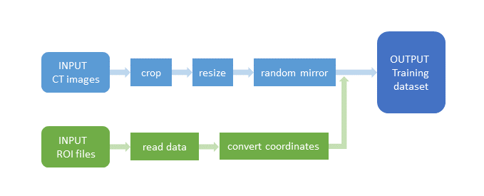

## Detect Defect Area in Cranial microCT Scan Images Using CNN and ResNet
#### Authors: Zhichao Pan (charles.zhpan@gmail.com) and Dr. Yuan (Sophie) Yang (sy.yang@utoronto.ca)
@[Bone Interface Group](http://www.ecf.utoronto.ca/~bonehead/), IBBME, University of Toronto 

### Project Overview
The purpose of this project is to create a data science pipeline to automate processing and analyzing of microCT scan data obtained from laboratory samples. Specifically, we are interested to apply deep learning techniques to detecting a surgically created circular defect  in every cross-sectional image of rat cranial bone. 

Regions of defect in the sample images below are circled in red, measured by human experts.


### Data Sets
The mouse cranial microCT scan data consists of 5,606 slice images from 65 microCT scanned samples. The full dataset for model training can be downloaded from https://www.kaggle.com/chzpan/bone-lab. The directory tree looks like:

```
 .
 |____roi
 |    |____C0005530.ISQroi
 |    |    |____0022-1059-0859.roi
 |    |    |____0023-1059-0859.roi
 |    |    |____...
 |    |____C0005531.ISQroi
 |    |    |____0003-1135-1011.roi
 |    |    |____0004-1135-1011.roi
 |    |    |____...
 |    |____...
 |____trainset
      |____C00055300022.png
      |____C00055300023.png
      |____...
```

#### File Contents
* roi.zip - contains the ground truth of each slice's defect region, measured by human experts. There are 65 sub-directories named with a unique 8-digit sample ID in the form of ``C000XXXX``, so each of them contains all ROI files for an individual sample. The ROI files are named in the form of ``XXXX-XXXX-XXXX``. The first 4 digits is a unique ID assigned to every single slice. The following 8 digits give the pixel coordinates of a circular defect region. For example, 1135-1011 represents a circle center of which is at (1011, 1135).
* trainset.zip: contains all slice images with size 2048 x 2048 in greyscale PNG format.


### Data Pre-processing
The following diagram shows our data pre-processing pipeline:


1. Load, crop and resize all images using the [load_image](src/utils.py) script;
2. Rotate and mirror images at random using the [mirror](src/utils.py) script;
3. Read the ground-truth data from all ROI files using the [get_centers](src/utils.py) script;
4. Map pixels of defect region center to a corrdinate system that starts from (0.0, 0.0) at upper-left corner and ends in (1.0, 1.0) at bottom-right corner, using [coord_transfm](src/utils.py) script;  
5. Stack the pixel values of all training images with their true centers row-wise to make a 2-D NumPy arrays.


### Algorithms and Architectures
At the outset of this project, we developed a simple CNN model and evaluate its performance to set a baseline. The model, having 7 layers and approximately 2 million parameters to train, was built from scratch using Keras with TensorFlow as the backend. 

Next We chose to perform our experiment using more sophisticated architetures that are among the most commonly referred in recent literature. The first one we are presenting here is ResNet-50. The ResNet-50 was originally designed for classification purpose by training on ImageNet, while the problem to tackle here is a regression one. Therefore we need to modify the network by removing the last softmax layer, replacing it with 3 fully connected layers, the last of which has linear activation and number of neurons equal to the dimension of target space.

The architecture of both network are depicted in below figures.

#### 7-layer CNN:


#### ResNet-50:


### Network Training
The models were trained on a NVIDIA Tesla P100 GPU with Keras 2.2.4 on the Tensorflow 1.14.0 backend. 

The original data set, containing more than 5,000 slice images, was sufficient to train the simple CNN model, while for the much deeper ResNet-50, we have to employ data augmentation to expand the size of training data to 15,000. We split the data set into training, validataion, test sets in 80/10/10 ratio.

The loss function to be optimized for this regression problem is the Mean Euclidean Distance (MED). We chose Adam as the optimizer. We had also tried RMSProp but it does not seem to be the optimizer of choice for our deep regression problem. To evaluate the performance of different models, we also introduced the RMSE metrics, which represents the sample standard deviation of the distance between the predicted values and human-measured values.

The base CNN model has been trained over 80 epochs. We started with an initial learning rate of 1e-3 and reduced it by 50% on plateauing, final learning rate at the end of 80 epochs was 1e-4. The ResNet-50 has been trained over 120 epochs, with initial learning rate of 1e-2.523 and final learning rate of 3e-5. The evolution of the loss function and RMSE metrics on both the training and validation sets are displayed in the below figures. 


### Hyper-parameter Tuning
We have employed random search to optimize hyper-parameters for the ResNet-50 model. The combination of hyper-parameters being examined includes:
* Starting learning rates
* Mini-batch sizes
* Drop-out ratios
* Depth of fully-connected layers
* Number of neurons in each fully-connected layers


### Results
The two models achieved comparable performance in detecting the defect regions on test set, both with MED of 0.004, approximately, which is on average around 5 pixels off from the locations measured by human experts. However, we can see that the prediction error of the ResNet-50 model spread more out than that of the CNN model (0.017 vs 0.007 in RMSE).

| Models | MED | MED (pixel) | RMSE |
| :-----: | :-----: | :-----: | :-----:|
| Simple CNN | 0.0038 | 5.05 | 0.0066 |
| ResNet-50 | 0.0039 | 5.12 | 0.0165 |

Some sample outputs made by the models from our test set are shown below.

#### 7-layer CNN:


#### ResNet-50:


### Dependencies
* Python 3
* [Tensorflow](https://www.tensorflow.org/)
* [Keras](https://keras.io/)
* numpy
* pandas
* matplotlib
* opencv
* sklearn
* intertool
* pil
* math
